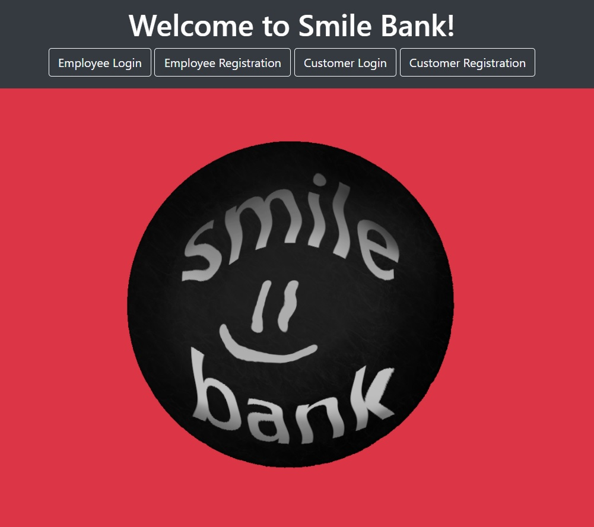
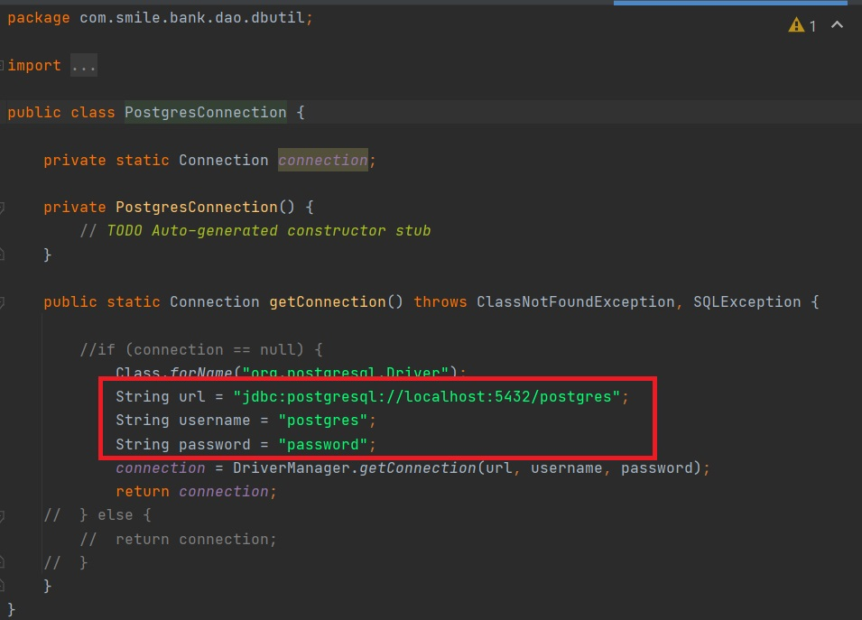
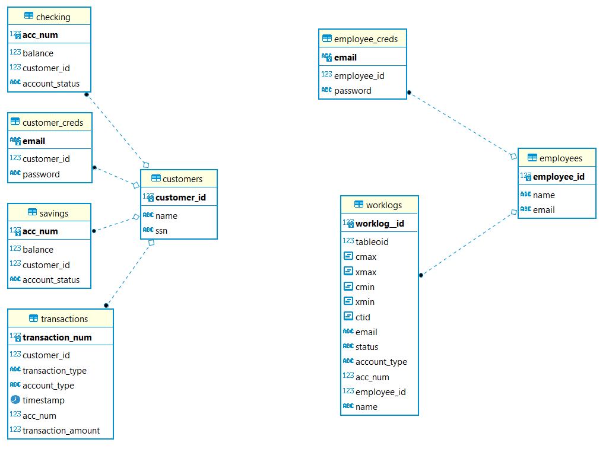
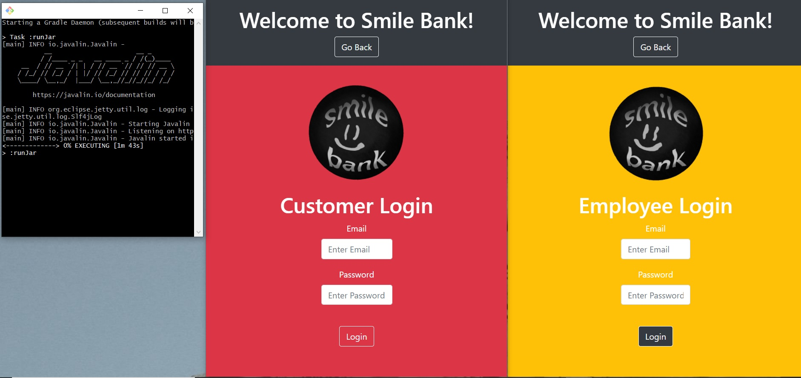
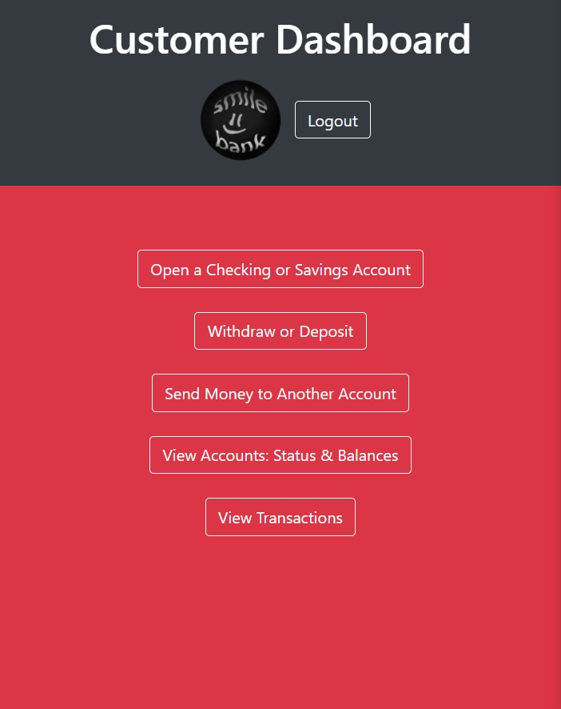
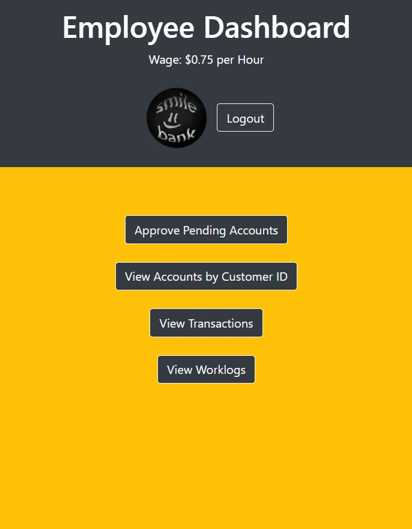

# Smile Bank

## Project Description

This project is a modified version of the Revature Online Banking App.

Within my implementation, credit cards and account freezing features are not implemented as per the modified design requirements.

## Features

* Customer and Employee can Register and Login

* Employee can approve or deny a Customer's Checking or Savings account creation request.
* Employee can view transaction logs and filter results. 
* Employee can view work logs to see who approved a particular customer account.

* Customer can apply for as many Checking or Savings accounts as they want.
* Customer can withdraw or deposit to any approved accounts.
* Customer can send money from any of their approved accounts to any other customer account.

## Tech Used

* HTML, JavaScript, CSS, Bootstrap - Front End
* Java, Javalin, JDBC, PostgreSQL - Back End

## Getting Started

Database configuration is left to the end user. They must edit the configuration in the Java code to match their connection settings and credentials and rebuild the Jar prior to using.

End user must have configured their database properly. 

After running the Jar a user can then register and login to the system.

Once logged into the system, the following dashboards are shown for each user type.

## Usage

Without following the setup, a user cannot effectively deploy the backend part of the application if they do not have a database model which is equal to the one I designed and utilized in the project. The only HTML pages a user can explore in this case will be the unauthenticated pages.

Once setup is complete, a user should be able to interact normally with the system.

First step is to complete registration forms. 

Second is to login to newly created accounts.

Third is to operate the system however user sees fit.

